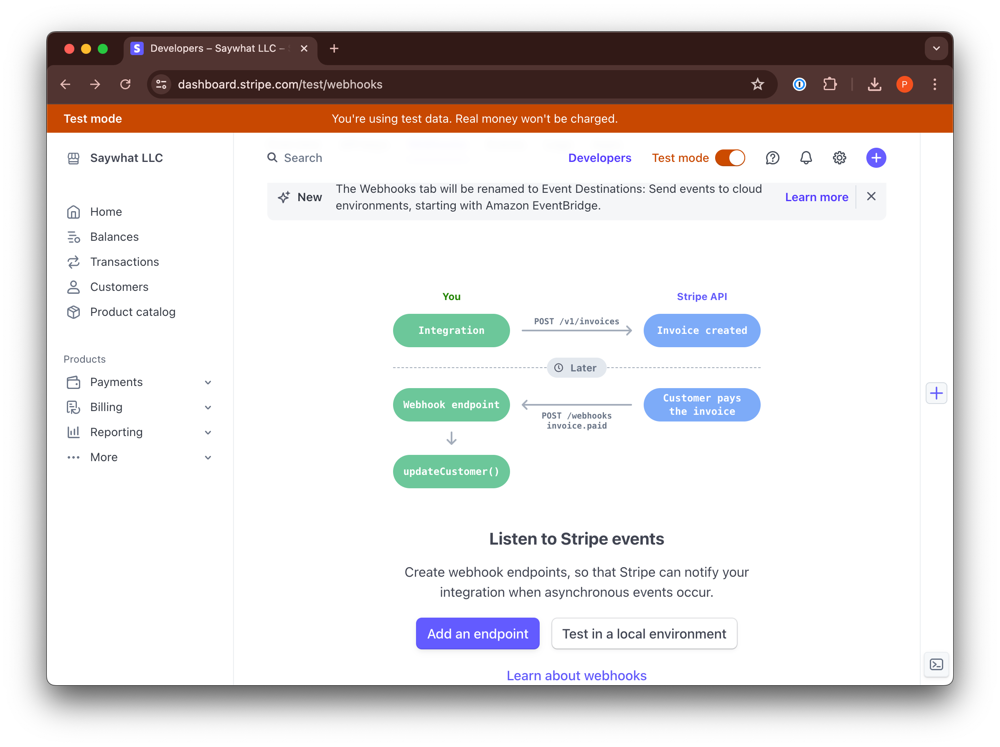
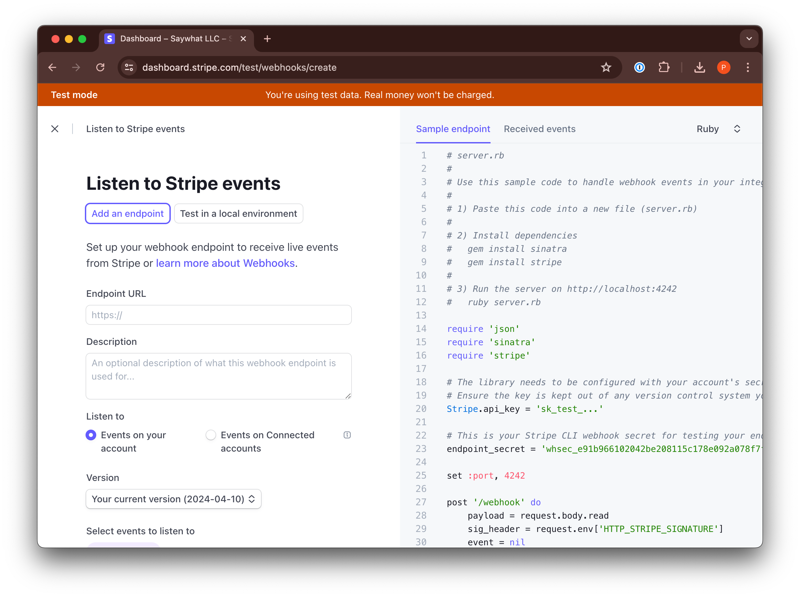

## Plans

High-level definition of plans are stored in an enum. These become the ground truth for the billing system. Note that these inherit from the `mountaineer_billing` base classes.

```python
# enums.py
from enum import StrEnum

from mountaineer_billing.products import MeteredIDBase, PriceIDBase, ProductIDBase


class ProductID(ProductIDBase):
    MYAPP_BRONZE = "MYAPP_BRONZE"
    MYAPP_SILVER = "MYAPP_SILVER"
    MYAPP_GOLD = "MYAPP_GOLD"

    MYAPP_5_ITEMS = "MYAPP_5_ITEMS"
    MYAPP_10_ITEMS = "MYAPP_10_ITEMS"
    MYAPP_25_ITEMS = "MYAPP_25_ITEMS"
    MYAPP_50_ITEMS = "MYAPP_50_ITEMS"


class PriceID(PriceIDBase):
    DEFAULT = "DEFAULT"


class MeteredID(MeteredIDBase):
    ITEM_GENERATION = "ITEM_GENERATION"
```

## Plans + Quotas

Definition of plans. We recommend a `plans.py` in the root of your project:

```python
from mountaineer_billing import (
    CountDownMeteredAllocation,
    LicensedProduct,
    Price,
    PriceBillingInterval,
)

from myproject.enums import MeteredID, PriceID, ProductID

PRODUCTS = [
    #
    # Subscription plans
    #
    LicensedProduct(
        id=ProductID.MYAPP_BRONZE,
        name="Myapp Bronze",
        count_down_allocations=[
            CountDownMeteredAllocation(
                asset=MeteredID.ITEM_GENERATION,
                quantity=5,
            ),
        ],
        prices=[
            Price(
                id=PriceID.DEFAULT,
                cost=999,
                frequency=PriceBillingInterval.MONTH,
            )
        ],
    ),
    LicensedProduct(
        id=ProductID.MYAPP_SILVER,
        name="Myapp Silver",
        count_down_allocations=[
            CountDownMeteredAllocation(
                asset=MeteredID.ITEM_GENERATION,
                quantity=10,
            ),
        ],
        prices=[
            Price(
                id=PriceID.DEFAULT,
                cost=1999,
                frequency=PriceBillingInterval.MONTH,
            )
        ],
    ),
    LicensedProduct(
        id=ProductID.MYAPP_GOLD,
        name="Myapp Gold",
        count_down_allocations=[
            CountDownMeteredAllocation(
                asset=MeteredID.ITEM_GENERATION,
                quantity=20,
            ),
        ],
        prices=[
            Price(
                id=PriceID.DEFAULT,
                cost=2999,
                frequency=PriceBillingInterval.MONTH,
            )
        ],
    ),
    #
    # Oneoff purchases to refill capacity
    #
    *[
        LicensedProduct(
            id=product_id,
            name=f"Myapp {credits} Credits",
            count_down_allocations=[
                CountDownMeteredAllocation(
                    asset=MeteredID.ITEM_GENERATION,
                    quantity=credits,
                )
            ],
            prices=[
                Price(
                    id=PriceID.DEFAULT,
                    cost=cost,
                    frequency=PriceBillingInterval.ONETIME,
                )
            ],
        )
        for product_id, credits, cost in [
            (ProductID.MYAPP_5_ITEMS, 5, 500),
            (ProductID.MYAPP_10_ITEMS, 10, 1000),
            (ProductID.MYAPP_25_ITEMS, 25, 2500),
            (ProductID.MYAPP_50_ITEMS, 50, 5000),
        ]
    ]
]

METERED_ROLLUPS : dict[MeteredIDBase, MeteredDefinition] = {
    MeteredID.ITEM_GENERATION: MeteredDefinition(
        usage_rollup=RollupType.AGGREGATE,
    ),
}

```

## Models + Config

As is the convention in Mountaineer, you'll need to explicitly import the database models and configuration values that are needed for the plugin.

```python
from mountaineer_billing import (
    CheckoutSession as CheckoutSessionBase,
)
from mountaineer_billing import (
    MeteredUsage as MeteredUsageBase,
)
from mountaineer_billing import (
    Payment as PaymentBase,
)
from mountaineer_billing import (
    ProductPrice as ProductPriceBase,
)
from mountaineer_billing import (
    ResourceAccess as ResourceAccessBase,
)
from mountaineer_billing import (
    Subscription as SubscriptionBase,
)

from myapp.enums import MeteredID, PriceID, ProductID


class ResourceAccess(ResourceAccessBase[ProductID]):
    pass


class MeteredUsage(MeteredUsageBase[MeteredID]):
    pass


class Payment(PaymentBase):
    pass


class Subscription(SubscriptionBase):
    pass


class ProductPrice(ProductPriceBase[ProductID, PriceID]):
    pass


class CheckoutSession(CheckoutSessionBase):
    pass
```

```python
from mountaineer_billing import UserBillingMixin

class User(UserAuthMixin, UserBillingMixin):
  ...

```

```python
from typing import Sequence

from mountaineer_billing import models as billing_models
from mountaineer_billing import BillingConfig
from mountaineer_billing import ProductBase

from myapp.plans import PRODUCTS

class AppConfig(
    ConfigBase,
    BillingConfig,
):
    # Billing config
    BILLING_USER: Type[billing_models.UserBillingMixin] = models.User
    BILLING_PRODUCT_PRICE: Type[billing_models.ProductPrice] = models.ProductPrice
    BILLING_PAYMENT: Type[billing_models.Payment] = models.Payment
    BILLING_SUBSCRIPTION: Type[billing_models.Subscription] = models.Subscription
    BILLING_METERED_USAGE: Type[billing_models.MeteredUsage] = models.MeteredUsage
    BILLING_RESOURCE_ACCESS: Type[billing_models.ResourceAccess] = models.ResourceAccess
    BILLING_CHECKOUT_SESSION: Type[
        billing_models.CheckoutSession
    ] = models.CheckoutSession
    BILLING_PRODUCTS: Sequence[ProductBase] = PRODUCTS
```


## Webapp Dependencies

## Daemons

If you want to increment quota, you can add a custom action that validates and increments the quota. While you could add the given dependencies to an existing action, we recommend creating a new action for clarity and independent retry behavior.

```python
from mountaineer import CoreDependencies
from iceaxe.mountaineer import DatabaseDependencies
from mountaineer_billing import BillingDependencies
from mountaineer.dependencies import get_function_dependencies

from pydantic import BaseModel
from myapp.config import AppConfig
from myapp.enums import MeteredID
from uuid import UUID
from waymark import action
from mountaineer import Depends
from mountaineer_auth import AuthDependencies

class BillForMeteredTypeRequest(BaseModel):
    user_id: UUID
    metered_id: MeteredID
    bill_amount: int = 1


@action
async def bill_for_metered_type(
    request: BillForMeteredTypeRequest,
    session: AsyncSession = Depends(DatabaseDependencies.get_db_session),
    config: AppConfig = Depends(CoreDependencies.get_config_with_type(AppConfig)),
) -> None:
    """
    Determine if the user has enough quota left for a given metered type
    If they do, logs one additional unit for it

    Raises ResourceExhausted if the user does not have enough quota.

    """
    user = await session.get(config.BILLING_USER, request.user_id)
    if not user:
        raise ValueError(f"Could not find user {request.user_id}")

    async def run_dependency(
        verify_capacity: bool = Depends(
            BillingDependencies.verify_capacity(
                request.metered_id,
                request.bill_amount,
            )
        ),
        allocate_new_capacity: bool = Depends(
            BillingDependencies.record_metered_usage(
                request.metered_id,
                request.bill_amount,
            )
        ),
    ):
        return verify_capacity and allocate_new_capacity

    def deterministic_user():
        return user

    async with get_function_dependencies(
        callable=run_dependency,
        dependency_overrides={AuthDependencies.peek_user: deterministic_user},
    ) as values:
        await run_dependency(**values)
```

## App Mounting

You'll need to mount the webhook endpoint to your application. We wrap all the routers that you'll need to mount individually in a single function.

```python
from mountaineer_billing import get_billing_router

controller.app.include_router(get_billing_router())
```

CLI usage for `billing-sync up` and `billing-sync down` is documented in the
README.

## Stripe

On the Stripe side, the setup is pretty much as easy as copying your API key and setting up webhooks.



If you are mounting the webhook handler as described above with `get_billing_router`, you should provide the `/external/billing/webhooks/stripe` url as your webhook endpoint. We currently only require events for the items defined in `StripeWebhookType`. Minimally select:

- `customer.subscription.deleted`
- `customer.subscription.updated`
- `customer.subscription.created`
- `checkout.session.completed`

But there's no harm in selecting all `customer.subscription` and `checkout.session` events. We'll filter down to what we currently support.



Once you've created the webhook, you'll need to copy the signing secret and paste it into your env configuration as `STRIPE_WEBHOOK_SECRET`.
